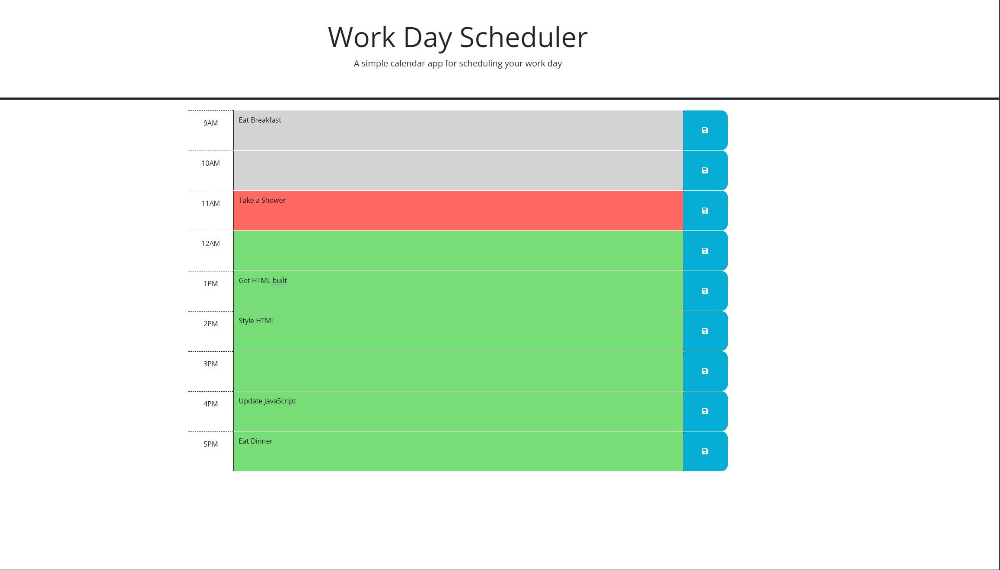

# Project Description
This is a simple scheduling app which you can use to outline your day's events. The information you put in the boxes will persist after the browser is closed thanks to the in-built local storage system.

## Page Preview
This is what the page should look like when launched properly, or viewed on a web browser.

## Webpage Link
> **Use this link to view the webpage:** [link to the webpage](https://antimatternova.github.io/Scheduling-app/)